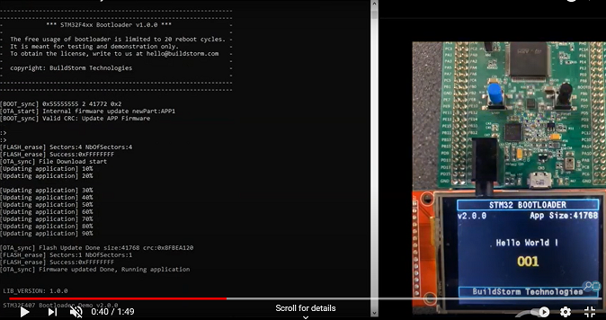

# stm32_bootloader_library
This bootloader solution allows you to update firmware on STM32 MCUs. It accepts data from serial ports and updates the firmware on the internal flash. The internal flash also has sector allocated to store application specific data. The solution can be customized to meet your specific needs.

Follow the below article for setting up and testing 
https://buildstorm.com/blog/getting-started-with-stm32-bootloader-library/

## Demo Video

