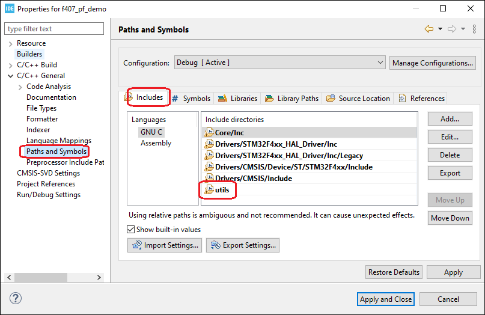
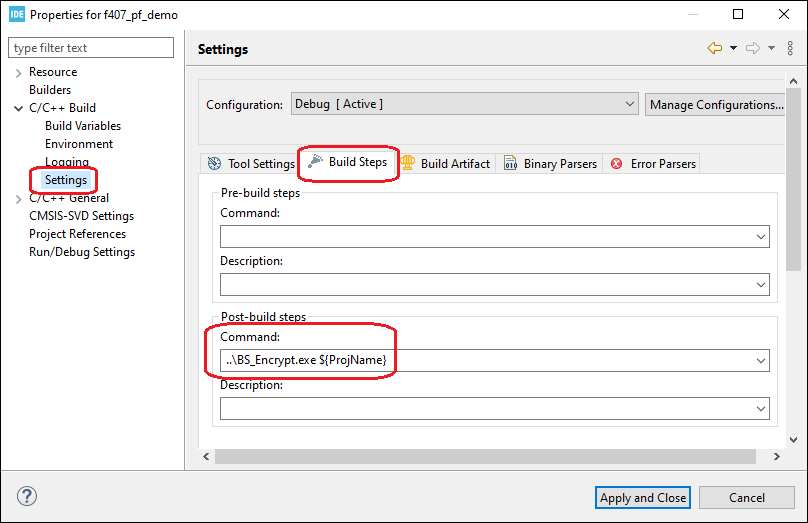

# stm32_bootloader_library
Bootloader library and firmware update tool for stm32f4xx series controllers.

<!-- TABLE OF CONTENTS -->
<details open="open">
  <summary><h2 style="display: inline-block">Table of Contents</h2></summary>
  <ol>
    <li>
      <a href="#getting-started">Getting Started</a>
      <ul>
        <li><a href="#prerequisites">Prerequisites</a></li>
        <li><a href="#installation">Installation</a></li>
      </ul>
    </li>
    <li><a href="#cli-tool-for-updating-firmware">CLI tool for updating firmware</a></li>
      <ul>
        <li><a href="#flash-bootloader-and-application">Flash Bootloader and Application</a></li>
        <li><a href="#flash-application-only">Flash application only</a></li>
      </ul>
    <li><a href="#custom-application-example">Custom Application Example</a></li>
      <ul>
        <li><a href="#memory-layout">Memory Layout</a></li>
        <li><a href="#linker-settings">Linker Settings</a></li>
        <li><a href="#include-libraries">Include Libraries</a></li>
        <li><a href="#include-object-file">Include Object file</a></li>
        <li><a href="#post-build-script">Post build script</a></li>
        <li><a href="#application-binary">Application Binary</a></li>        
      </ul>
    <li><a href="#license">License</a></li>
  </ol>
</details>


<!-- GETTING STARTED -->
## Getting Started

### Prerequisites

* Install the [Stlink utility and drivers](https://github.com/SaheblalBagwan/stlink-utility-and-drivers) and update the installation path to environment variables <b>C:\Program Files (x86)\STMicroelectronics\STM32 ST-LINK Utility\ST-LINK Utility</b>.
* Ensure the bootloader binary and test application binaries are available at <b>root/cli-Tool/binaries</b>

### Installation

* [Stlink utillity and drivers](https://github.com/SaheblalBagwan/stlink-utility-and-drivers)


<!-- CLI -->
## CLI tool for updating firmware
1. Connect the device to the PC and note down the COM port from the device manager. 
2. Ensure the USB-to-Serial is connected to UART2 of Stm32 (PA2 &PA3).
3. Open the command line from the project root folder and run the below command
  ```` sh
  stm32UpdateTool-win.exe <COMxx>
  ```` 
4. Use the below commands for flashing the bootloader and application.
  
  
5. **Testing Bootloader**
   * The bootloader binary is available in **.\binaries** folder and same is hardcoded in the CLI tool. For flashing the bootloader, user need not provide the path. 
   * For testing, two application binaries are available in **.\binaries** folder. The required application binary file path has to be provided for flashing the application. CLI also allows to flash the custom application by providing the absolute path to the below commands.
   ````    
    flash all <application file path>  This will flash the bootloader from .\binaries\bootloader.bin and
                                       the application from the specified path.
   ```` 
   ```` 
    flash app <application file path>  This will only flash the application from the specified path.
   ````
 6. #### Flash Bootloader and Application
     * Flash both bootloader and application using the flash all command as shown below.
     ````  
     flash all .\binaries\application_v200.bin
     ````  
     * CLI will takes care of flashing the bootloader and application one after the other.
     * After successful update of the firmware, device will print the versions numbers. Notice the version number and LED pattern.


  7. #### Flash application only
     * In the previous section we have flashed bootloader and application v200, this time lets flash only the new application firmware v201.
     ````  
     flash app .\binaries\application_v201.bin
     ````  
     * After successful update, notice the change in firmware version and LED pattern.
     
  
  <!-- Custom Application example -->
## Custom Application Example
Use the f407_app project to build the custom application. It uses the pre-compiled library object which will be linked with user application.

- ### Memory Layout

| Type | Address |	size	| No of Sectors |	Sector index |
| :---: | :---: | :---: | :---: | :---: |
| Bootloader |	0x08000000 | 14KB	| 1	| 0 |
| Bootloader Config |	0x08001000 |	16KB |	1 |	1 |
| Application	| 0x08010000 |	448KB |	4 |	4 - 7 |
| Temporary Download Partition	| 0x08070000 |	512KB |	4 |	8 - 11 |

- ### Linker Settings
  Application resides at 0x08010000 and same has to be configured in the linker settings as shown below.
  ````
  MEMORY
  {
   CCMRAM    (xrw)    : ORIGIN = 0x10000000,   LENGTH = 64K
   RAM    (xrw)    : ORIGIN = 0x20000000,   LENGTH = 128K
   FLASH    (rx)    : ORIGIN = 0x8010000,   LENGTH = 448K
  }
  ````
- ### Include Libraries
  Inculde the **utils** folder containing the library header files to the project. 
  
  
- ### Include Object file
  Include the precompiled object file to the project.
  
  
- ### Post build script
  The final application binary file will be encrypted using executable script(BS_ENCRYPT.exe). It has to added to project settings.
  
  
- ### Application Binary
  The final encrypted application binary will be generated in Debug folder as **projectName_release.bin**. This file can be used for Serial/OTA firmware updates.


